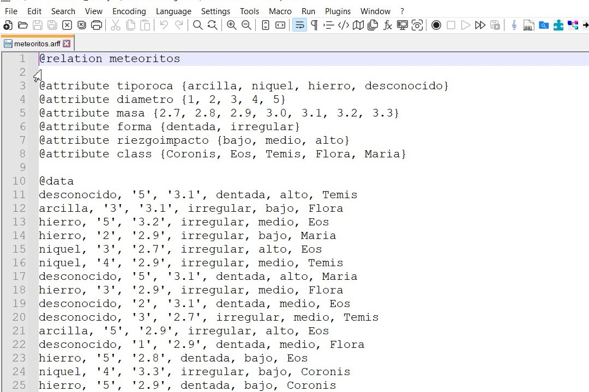

# arff-generator

*Léelo en [English](README.md).*

Generador de archivos **ARFF** (*Attribute-Relation File Format*, el formato de datasets usado por [Weka](https://www.cs.waikato.ac.nz/ml/weka/)) con datos generados aleatoriamente a partir de los atributos y valores que definas.

Útil para crear datasets de prueba rápidamente sin tener que escribir el `.arff` a mano.

## Requisitos

- Python 3.6+ (solo librería estándar: `random`, `os`)

## Uso

Define la relación, los atributos con sus posibles valores y el atributo de clasificación, luego llama a `randomize()`:

```python
from arffclass import *

file = arffGenerator()
file.setDatas(20)                  # cantidad de filas de datos a generar
file.setRelation("meteoritos")     # nombre de la relación
file.setFileName("prueba")         # nombre del archivo (se le añade .arff)

# valores posibles del atributo de clasificación
file.setClass(["Coronis", "Eos", "Temis", "Flora", "Maria"])

# atributo y sus valores posibles
file.setAttribute("tiporoca", ["arcilla", "niquel", "hierro", "desconocido"])
file.setAttribute("diametro", [1, 2, 3, 4, 5])
file.setAttribute("masa", [2.7, 2.8, 2.9, 3.0, 3.1, 3.2, 3.3])
file.setAttribute("forma", ["dentada", "irregular"])
file.setAttribute("riezgoimpacto", ["bajo", "medio", "alto"])

file.randomize()   # genera el archivo .arff con datos aleatorios
```

Ejecuta:

```bash
python main.py
```

Genera `prueba.arff` en el directorio actual. Si el archivo ya existe, lo sobrescribe.

## Salida de ejemplo

```
@relation meteoritos

@attribute tiporoca {arcilla, niquel, hierro, desconocido}
@attribute diametro {1, 2, 3, 4, 5}
@attribute masa {2.7, 2.8, 2.9, 3.0, 3.1, 3.2, 3.3}
@attribute forma {dentada, irregular}
@attribute riezgoimpacto {bajo, medio, alto}
@attribute class {Coronis, Eos, Temis, Flora, Maria}

@data
desconocido, '5', '3.1', dentada, alto, Temis
arcilla, '3', '3.1', irregular, bajo, Flora
hierro, '5', '3.2', irregular, medio, Eos
hierro, '2', '2.9', irregular, bajo, Maria
niquel, '3', '2.7', irregular, alto, Eos
niquel, '4', '2.9', irregular, medio, Temis
desconocido, '5', '3.1', dentada, alto, Maria
hierro, '3', '2.9', irregular, bajo, Flora
...
```

> Los valores numéricos se escriben entre comillas simples (`'3'`) para que Weka los trate como nominales, igual que el resto de atributos.



## API — `arffGenerator`

| Método | Descripción |
|--------|-------------|
| `setDatas(int)` | Número de filas de datos a generar |
| `setRelation(str)` | Nombre de la relación (`@relation`) |
| `setFileName(str)` | Nombre del archivo de salida (se le añade `.arff`) |
| `setClass([...])` | Valores posibles del atributo de clasificación `class` |
| `setAttribute(nombre, [...])` | Añade un atributo y su lista de valores posibles |
| `randomize()` | Genera el archivo `.arff` con los datos aleatorios |

Cada `set*` valida el tipo de entrada y lanza una excepción si es incorrecto (p. ej. `setDatas` exige `int`, `setAttribute` exige `list` de valores).

## Archivos

| Archivo | Propósito |
|---------|-----------|
| [arffclass.py](arffclass.py) | Clase `arffGenerator` (API reutilizable) |
| [main.py](main.py) | Ejemplo de uso de la clase |
| [simpleconsole.py](simpleconsole.py) | Versión script standalone, sin clase (configuración por variables) |

## Notas

- `simpleconsole.py` trae `datas = 10000000` por defecto — generaría un archivo enorme. Ajusta ese valor antes de ejecutarlo.
- El nombre del atributo de clasificación es siempre `class`; `randomize()` lo añade automáticamente a partir de `setClass()`.
